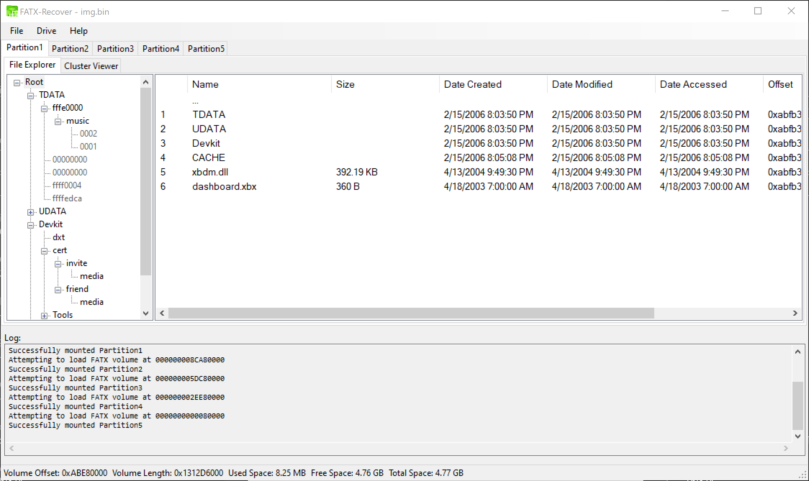
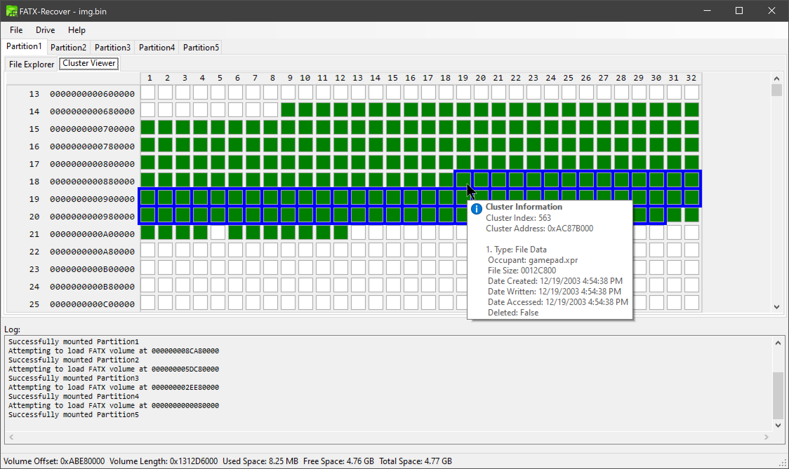
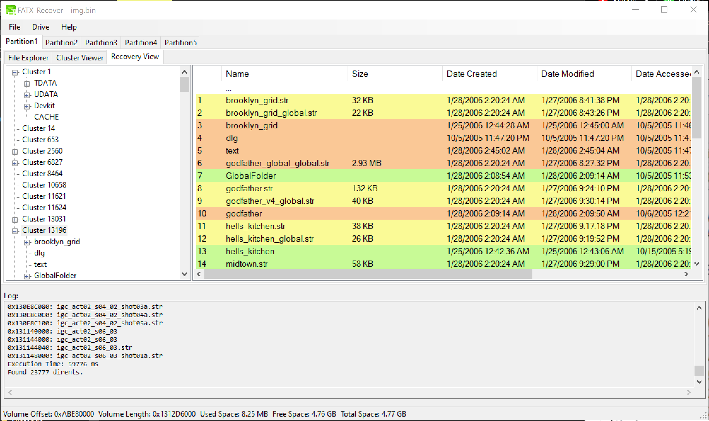
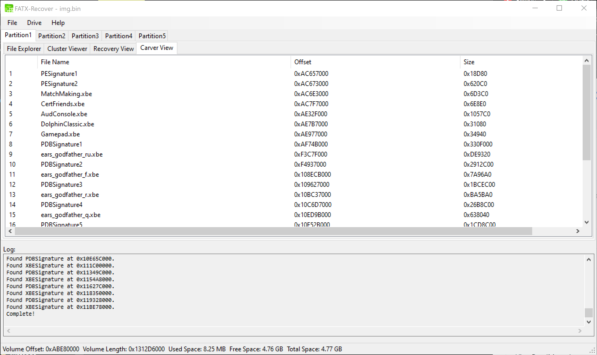

# FATXTools 
FATXTools is a data recovery tool for FATX file systems. The goal of this project is to automate searching and recovering deleted files as well as provide tools for manual data recovery.

This is a C# port of the Python version: [fatx-tools](https://github.com/aerosoul94/fatx-tools)

Download: [AppVeyor](https://ci.appveyor.com/project/aerosoul94/fatxtools/build/artifacts)

# Contributors
* Tdijital - Thanks for the bug reports and the amazing app logo <3
* The many many testers who provided bug reports <3

# Features
* Supports loading from hdd images or physical devices.
* Use the Cluster Viewer to visually see what data occupies any cluster.
* Metadata Analyzer scans for abandoned file system metadata.
* File Carver scans for files based on their file formats.
* Save results to an editable and reloadable json database.

# Screenshots

